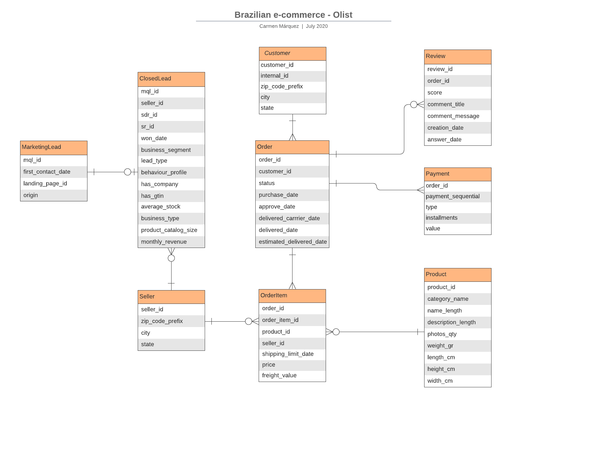

# Generate SQL Database to analize Olist lead aquistion performance and other results
In this project the main goal for me was to use SQL to find out how different Marketing variables had performed. I used the Marketing Funnel and eCommerce datasets facilitated by Olist in Kaggle.

## E/R Diagram
The first step to model and normalize some external data is to understand the content stored by each entity and the relationships between them. With that purpose, I have generated the following E/R Diagram:


## Initial Data Cleaning
Before importing the data in the database a normalization of the database is required:
* **Dates with empty values have to be normalized** using a default value such as *2000-01-01 00:00:00* (using the MySQL wizard to import csv files does not recognize NULL values for dates). The dataset for orders is the only one affected.
* **Numeric with empty values have to be normalized to 0**. The Closed deals dataset is the only one affected by this.

## Import into Mysql
The Import Wizard provided by MySQL present some limitation so a few modifications are needed after the import:
* Convert TEXT types into VARCHAR(75) except for review comments (VARCHAR(2000)). Not using CLOBS provides more flexibility with queries.
* Define primary keys.

The final database definition can be found [here](tables.sql).

Note: no foreign keys are used since the data is external and we can not ensure referential Integrity


## Marketing queries and results
Find below some relevant information extracted from the database:

### Percentage closed deals
```SQL
SELECT round((count(cd.mql_id)/count(mql.mql_id))*100, 2) AS '% Closed deals'
FROM MarketingQualifiedLead mql LEFT JOIN ClosedDeal cd ON mql.mql_id = cd.mql_id
```

% Closed deals |
---------------| 
10.53 |

### Percentage and number of closed deals by acquisition channel
```SQL
SELECT origin as 'Acquisition channel', count(origin) AS 'Number of closed deals',
round((count(origin)/(SELECT COUNT(*) FROM ClosedDeal))*100, 2) AS '% Closed deals'
FROM MarketingQualifiedLead mql JOIN ClosedDeal cd ON mql.mql_id = cd.mql_id GROUP BY origin ORDER BY count(origin) DESC 
```

Acquisition channel	| Number of closed deals | % Closed deals
------------------- | ---------------------- | --------------
organic_search | 271 | 32.19
paid_search	| 195 |	23.16
unknown |	179 |	21.26
social | 75 |	8.91
direct_traffic |	56 |	6.65
referral | 24 |	2.85
email | 15 |	1.78
non-provided	| 14 |	1.66
display |	6	| 0.71
other	| 4	| 0.48
other_publicities	| 3	| 0.36

### Top 10 Products based on reviews (minimum 3)
```SQL
SELECT p.product_id, p.product_category_name AS category, round(avg(r.review_score),2) AS average_review, count(p.product_id) AS times_sold
FROM OrderItem oi JOIN Product p ON oi.product_id = p.product_id JOIN Review r ON oi.order_id = r.order_id
GROUP BY p.product_id HAVING times_sold > 3 ORDER BY average_review DESC, times_sold DESC
```

product_id | category |	average_review	| times_sold
---------- |--------- |---------------- | ----------
56c221c4c1a4a98293895c4563cdc6bf | construcao_ferramentas_seguranca |	5 |	6
7c03e2562178adecc404571f7c52db4e | ferramentas_jardim |	5 |	5
53b36df67ebb7c41585e8d54d6772e08 | relogios_presentes |	5 |	5
913eefa4eb54c8a9bcb9871dfd94a0ca |	ferramentas_jardim |	5 |	4
363218ba55c610b750224f90bdd34be1 |	cama_mesa_banho |	4.8 |	5
f1c7f353075ce59d8a6f3cf58f419c9c |	cama_mesa_banho |	4.8 |	5
389d119b48cf3043d311335e499d9c6b |	ferramentas_jardim |	4.75 |	4
35afc973633aaeb6b877ff57b2793310 |	casa_conforto |	4.75 |	4
aca2eb7d00ea1a7b8ebd4e68314663af |	moveis_decoracao |	4.6 |	5
473795a355d29305c3ea6b156833adf5 |	perfumaria |	4.5 |	4

### Top 10 worst products based on reviews (minimum 3)
```SQL
SELECT p.product_id, p.product_category_name AS category, round(avg(r.review_score),2) AS average_reviews, count(p.product_id) AS times_sold
FROM OrderItem oi JOIN Product p ON oi.product_id = p.product_id JOIN Review r ON oi.order_id = r.order_id
GROUP BY p.product_id HAVING times_sold > 3 ORDER BY average_reviews ASC, times_sold DESC
```

product_id |	category |	average_reviews |	times_sold
---------- |---------- |----------------- |-----------
31a89a7044c5b133cf646404a4e86022 |	utilidades_domesticas |	1 |	6
56d45b2c27871322801134f57d1b9dfb |	cama_mesa_banho |	1 |	4
19421075ae0b585f2dc13ff149e2119d |	esporte_lazer |	2 |	4
dbb67791e405873b259e4656bf971246 |	informatica_acessorios |	2.71 |	7
1a300f482e35d7eac74b229be067aefd |	informatica_acessorios |	3 |	5
bbaef2eadf31fe3ea6702077398be06c |	perfumaria |	3 |	4
7c1bd920dbdf22470b68bde975dd3ccf |	beleza_saude |	3.2 |	5
99a4788cb24856965c36a24e339b6058 |	cama_mesa_banho |	3.25 |	12
dca8cbb1c9d8a2db0fbc0c36b8d1a7bc |	audio |	3.25 |	4
154e7e31ebfa092203795c972e5804a6 |	beleza_saude |	3.5 |	4

### Top 10 best-selling products
```SQL
SELECT p.product_id, p.product_category_name AS category, count(p.product_id) AS times_sold
FROM OrderItem oi JOIN Product p ON oi.product_id = p.product_id GROUP BY p.product_id ORDER BY times_sold DESC
```

product_id |	category |	times_sold
---------- |---------- |------------
aca2eb7d00ea1a7b8ebd4e68314663af |	moveis_decoracao |	527
99a4788cb24856965c36a24e339b6058 |	cama_mesa_banho |	488
422879e10f46682990de24d770e7f83d |	ferramentas_jardim |	484
389d119b48cf3043d311335e499d9c6b |	ferramentas_jardim |	392
368c6c730842d78016ad823897a372db |	ferramentas_jardim |	388
53759a2ecddad2bb87a079a1f1519f73 |	ferramentas_jardim |	373
d1c427060a0f73f6b889a5c7c61f2ac4 |	informatica_acessorios |	343
53b36df67ebb7c41585e8d54d6772e08 |	relogios_presentes |	323
154e7e31ebfa092203795c972e5804a6 |	beleza_saude |	281
3dd2a17168ec895c781a9191c1e95ad7 |	informatica_acessorios |	274

### Top 10 sellers
```SQL
SELECT s.seller_id, s.seller_city, s.seller_state, count(s.seller_id) AS seller_sales
FROM OrderItem oi JOIN Seller s ON oi.seller_id = s.seller_id GROUP BY s.seller_id ORDER BY seller_sales DESC
```

seller_id |	seller_city |	seller_state |	seller_sales
--------- |------------ |------------- |--------------
6560211a19b47992c3666cc44a7e94c0 |	sao paulo |	SP |	2033
4a3ca9315b744ce9f8e9374361493884 |	ibitinga |	SP |	1987
1f50f920176fa81dab994f9023523100 |	sao jose do rio preto |	SP |	1931
cc419e0650a3c5ba77189a1882b7556a |	santo andre |	SP |	1775
da8622b14eb17ae2831f4ac5b9dab84a |	piracicaba |	SP |	1551
955fee9216a65b617aa5c0531780ce60 |	sao paulo |	SP |	1499
1025f0e2d44d7041d6cf58b6550e0bfa |	sao paulo |	SP |	1428
7c67e1448b00f6e969d365cea6b010ab |	itaquaquecetuba |	SP |	1364
ea8482cd71df3c1969d7b9473ff13abc |	sao paulo |	SP |	1203
7a67c85e85bb2ce8582c35f2203ad736 |	sao paulo |	SP |	1171

### Top 10 Sellers with more revenue
```SQL
SELECT s.seller_id, s.seller_city, s.seller_state, round(sum(p.payment_value), 2) as seller_revenue
FROM OrderItem oi JOIN Seller s ON oi.seller_id = s.seller_id JOIN Payment p ON oi.order_id = p.order_id
GROUP BY s.seller_id ORDER BY seller_revenue DESC
```

seller_id |	seller_city |	seller_state |	seller_revenue
--------- |------------ | ------------ | ---------------
7c67e1448b00f6e969d365cea6b010ab |	itaquaquecetuba |	SP |	507166.91
1025f0e2d44d7041d6cf58b6550e0bfa |	sao paulo |	SP |	308222.04
4a3ca9315b744ce9f8e9374361493884 |	ibitinga |	SP |	301245.27
1f50f920176fa81dab994f9023523100 |	sao jose do rio preto |	SP |	290253.42
53243585a1d6dc2643021fd1853d8905 |	lauro de freitas |	BA |	284903.08
da8622b14eb17ae2831f4ac5b9dab84a |	piracicaba |	SP |	272219.32
4869f7a5dfa277a7dca6462dcf3b52b2 |	guariba |	SP |	264166.12
955fee9216a65b617aa5c0531780ce60 |	sao paulo |	SP |	236322.3
fa1c13f2614d7b5c4749cbc52fecda94 |	sumare |	SP |	206513.23
7e93a43ef30c4f03f38b393420bc753a |	barueri |	SP |	185134.21


## Resources:
Original datasets can be found in:
* https://www.kaggle.com/olistbr/brazilian-ecommerce
* https://www.kaggle.com/olistbr/marketing-funnel-olist
